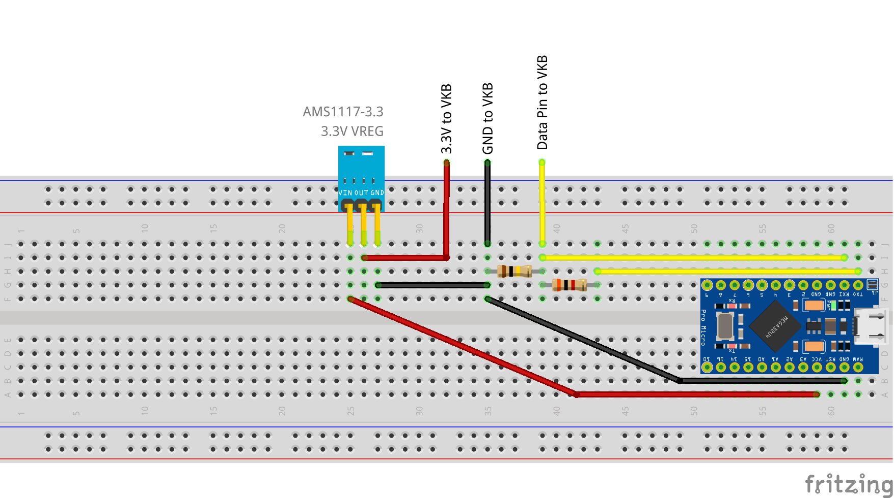

# VKB_Grip_Test
 Basic Arduino interface to VKB Gunfighter grip

Previous breadcrumbs on decoding the grip protocol: [https://www.reddit.com/r/HotasDIY/comments/lckamn/vkb_3_wire_protocol/](https://www.reddit.com/r/HotasDIY/comments/lckamn/vkb_3_wire_protocol/)